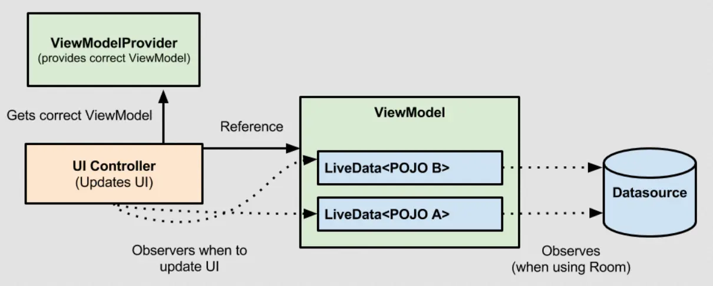

1、ViewModel 一个 Android 上使用 MVVM 的规范
https://www.jianshu.com/p/30bc7071c6df

ViewModel 是个抽象类，作用是为 Activity/Fragment 这样的视图控制器来存储和管理相关数据。
一个 ViewModel 对象的创建会和 Activity/Fragment 的创建关联起来，并且随着 Activity/Fragment 的消亡，也随之消亡。
（有一种情况比较特殊，当屏幕旋转造成 Activity/Fragment 生命周期重走，并不会引起 ViewModel 对象的重建。）
在数据操作上，ViewModel 的数据变更会通过 LiveData 或者 DataBinding 的方式通知到 Activity/Fragment 上来展现。
所以实现 MVVM 的关键就是 Lifecycle 的概念 + LiveData + ViewModel。

loginViewModel = new ViewModelProvider(this, new LoginViewModelFactory()).get(LoginViewModel.class);

ViewModel 对象的创建需要通过 ViewModelProvider 来实现。
根据提供的构造方法，ViewModelStoreOwner 对象是必须提供的，ViewModelStoreOwner 是个接口，描述的是 ViewModelStore
 的持有者，系统的 ComponentActivity 就实现了这个接口。
 而 ViewModelStore 可以理解为 ViewModel 的仓库，用来缓存 ViewModel 的，内部实现是一个 HashMap 类型的集合，
 说明可以存储多个 ViewModel 对象。

所以就以 Activity 为例，Activity 相当于拥有者一个可以存储 ViewModel 的仓库，那这个仓库的 ViewModel 对象具体怎么存取呢？
回看到前面的构造方法，ViewModelProvider 还需要我们提供一个 Factory 类型的对象，结合 ComponetActivity 可以知道，它也实现
了 HasDefaultViewModelProviderFactory 接口，接口方法要求返回一个 ViewModelProvider.Factory 类型对象，

MVVM
再来说说 MVVM 的架构模式，它是基于 MVP 的一种改进，因为随着业务的增多，导致 p 层的膨胀臃肿，变的难以维护。所以将 P 层改为
 VM 层，实现 VM 和 V 层还有 M 层的双向绑定，即 V 层的变动会使得 VM 引起 M 层的变更，M 层的变动也会使 VM 通知 V 层进行更新。
 不仅灵活度增加了，p 层也被拆分化简。

具体的化简是怎么实现呢？结合 Lifecycle，LiveData，ViewModel，我对 MVVM 的实现是这么理解的。V 层依然是 Activity/Fragment，M
层管理的数据来源，但实际项目中不会分的那么细致，例如会融合到 P 层上。因为 VM 层代替了原来的 P 层，因此 VM 层的实现会有多个
ViewModel 类来管理。

为什么是多个 ViewModel 类对应一个 V 层呢？我的理解是，首先 V 层对应的实现一般会持有一个 ViewModel 仓库，这个仓库可以存放多
个 ViewModel 对象。其次，ViewModel 的划分并不像 P 层，更合理的划分是和数据模型相关，例如 UserViewModel 就是用来管理 User 数
据的，ClassViewModel 就是用来管理 Class（课程）数据的。所以这样就会使得 V 层对应着 1 到 多个 ViewModel。

这样的好处是，1. 数据管理更清晰，2. ViewModel 可以在整个项目中复用，而不像 P 层，可能只能给这个 V 层用。缺点是，代码量又要
增加了，可能 ViewModel 维护的数据模型很基础很简单，但也要为其做一些维护。
当然一个 ViewModel 里也可以维护着多个 LiveData（即维护多个数据模型），但这样的话感觉就和 MVP 的思想没什么区别了。

## ViewModel怎么感知生命周期的？
Vm 创建的时候提到过 实例化了一个 HolderFragment.

## 维护多个ViewModel的情况，某些情况下存在多个fragments使用同一个ViewModel。
这种情况下，livedata被先被谁观察到呢？

##LiveData具有生命感知功能，并且只在View处于激活状态时进行消息的通知。我们
通过一层封装，在充分利用LiveData的优势的条件下，实现我们只进行一次消息通知的功能。
LiveData怎样感知生命周期的？

2、ViewModel旨在以生命周期意识的方式存储和管理用户界面相关的数据,它可以用来管理Activity和Fragment中的
数据.还可以拿来处理Fragment与Fragment之间的通信等等.
当Activity或者Fragment创建了关联的ViewModel,那么该Activity或Fragment只要处于活动状态,那么该ViewModel
就不会被销毁,即使是该Activity屏幕旋转时重建了.所以也可以拿来做数据的暂存.
ViewModel主要是拿来获取或者保留Activity/Fragment所需要的数据的,开发者可以在Activity/Fragment中观察
ViewModel中的数据更改(这里需要配合LiveData使用).
ps: ViewModel只是用来管理UI的数据的,千万不要让它持有View、Activity或者Fragment的引用(小心内存泄露)。

//Activity和Fragment共享同一个ViewModel。
因为Fragment是依附在Activity上的,在实例化ViewModel时将该Activity传入ViewModelProviders,它会给你一个该Activity已创建好了的。
UserModel userModel = ViewModelProviders.of(getActivity()).get(UserModel.class);

Fragment与Fragment"通信"也可以使用这个方法。

为啥？从上述解决的问题来看，ViewModel很明显生命周期会比Activity要长，因此如果持有Activity相关实例，必然会带来内存泄漏。（那如果的确有业务需要咋整？使用AndroidViewModel(application)即可。）

值得注意的一点：of方法需要传递一个Activity/Fragment。因为ViewModel需要与其生命周期绑定。既然可以传递一个Activity，那么我们就能够猜到：是不是对于此Activity下的Fragment这个ViewModel也是可见的？
没错，正是如此。官方也作出了解读：Activity中的两个或多个Framgent需要相互通信是很常见的，这个常见的痛点可以通过使用ViewModel对象来解决，这些Fragment可以共享ViewModel来处理通信问题。
所以我们在同Activity下，不同的Fragment实例，可以直接通过传入activity，拿到同样的ViewModel实例，进而实现数据通讯。

##
Activity内部多个ViewModel的有什么好处？

3、https://www.jianshu.com/p/35d143e84d42
深入了解架构组件之ViewModel

https://www.jianshu.com/p/e8955f525f4c
【大揭秘】Android架构组件ViewModel来龙去脉

ViewModel是存储UI相关数据并不会因为旋转而销毁的类。
最为重要的就是ViewModel具有下面的生命周期，这就是ViewModel的最可贵之处：

正因为ViewModel有如此的生命周期，所以ViewModel在MVVM可以作为数据存储区，是连接View和Model重要组件，  
ViewModel的核心作用如下图所示：

ViewModel 的存在是依赖 Activity 或者 Fragment的，不管你在什么地方获取ViewModel ，只要你用的是相同的Activity 或者  
Fragment，那么获取到的ViewModel将是同一个 (前提是key值是一样的)，所以ViewModel 也具有数据共享的作用！

/*****第一步:根据Activity或者Fragment获得ViewModelProvider****/
ViewModelProvider viewModelProvider = ViewModelProviders.of(ActivityGirls.this);

/*****第二步:使用ViewModelProvider反射创建需要的ViewModel****/
GirlsViewModel girlsViewModel = viewModelProvider.get(GirlsViewModel.class);

第一： AndroidViewModelFactory在正常情况下是全局单例只有一个，只是一个反射创建对象的工具类。
第二：ViewModelProvider是每次获取创建ViewModel的时候都会创建一个新的。
第三：ViewModelStore是每一个Activity或者Fragment都有一个。

代码很简单，流程如下:
(1) 先从mViewModelStore中使用key去获取ViewModel, mViewModelStore中是使用HashMap去存储一个Activity或者Fragment的  
ViewModel的。如果获取到就返回。
(2) 没获取到就使用单例mFactory的create方法反射创建ViewModel,create方法的代码在上面贴出来了。
(3) 使用Key存入mViewModelStore 并返回。

一句话总结ViewModel是怎么被创建的：
创建一个ViewModelProvider，使用ViewModelProvider内部的全局单例AndroidViewModelFactory来反射创建 ViewModel,并把创建  
的ViewModel存入传入的ViewModelStore中！

这句创建总结其实也说明了ViewModel的存储。
进一步解释：
ViewModel是存储在当前Activity / Fragment 的 HolderFragment 中的ViewModelStore的HashMap中，我们可以get,put或者在  
Activity / Fragment销毁的时候HolderFragment会跟随销毁，在HolderFragment的onDestroy方法中调用mViewModelStore的clear方法。

1.ViewModel 以键值对的形式存在Activity或者Fragment的HolderFragment的ViewModelStore的HashMap中。
2.一个Activity或者Fragment可以有很多个ViewModel。
3.一个Activity或者Fragment只会有一个HolderFragment。
4.Activity或者Fragment的HolderFragment会保存在全局单例的HolderFragmentManager的HashMap中，在Activity  
或者Fragment销毁的时候会移除HashMap中对应的value。
5.因为ViewModel是以Activity或者Fragment为存在基础，所以ViewModel可以在当前Activity和Fragment中实现数据共享  
，前提是传入相同的key值。

4、liveData的使用